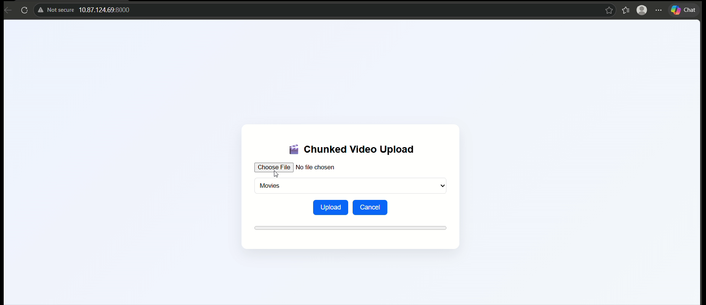
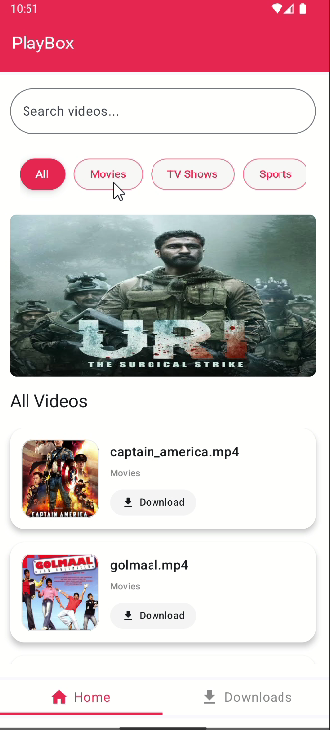
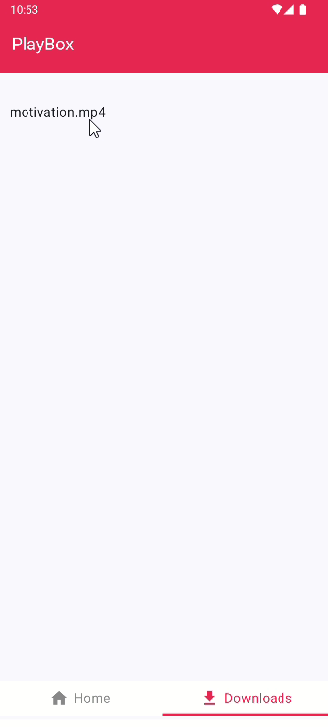

# 🎬 PlayBox2 — Video On Demand (VOD) App


## 🚀 Project Overview

**PlayBox2** is a full-stack Video-On-Demand (VOD) Android application built with **Jetpack Compose** and **ExoPlayer**, paired with a **Node.js + Express backend** for efficient video streaming, chunked uploads, and category-based content organization.

It provides:

- Smooth video playback
- Category tabs for organized content
- Efficient backend streaming with chunk merging
- Offline-friendly caching using Room Database


---


## 📸 Screenshots

<p align="center">
  
</p>


<p>
   <br> 
  
  
</p>

▶️ Full video: https://youtu.be/00FonEQys88


---

## 🗂️ Project Structure

PlayBox2/
├── android/ # Android app
│ ├── app/
│ ├── build.gradle
│ └── ...
├── backend/ # Node.js + Express server
│ ├── server.js
│ ├── routes/
│ ├── uploads/
│ ├── chunks/
│ └── package.json
├── README.md
└── .github/


---

## ⚡ Key Features

### Android App (Jetpack Compose + ExoPlayer)

- Category tabs with dynamic video lists  
- Offline caching using Room database  
- Smooth video playback with ExoPlayer  
- MVVM architecture for clean separation of concerns  

### Backend (Node.js + Express)

- Chunked video upload with merging  
- Video streaming with range requests for efficient playback  
- JSON metadata for video list and categories  
- Cross-origin support with CORS  

---

## 🛠️ Tech Stack

| Layer        | Technology |
|--------------|------------|
| Android      | Kotlin, Jetpack Compose, ExoPlayer, Worker Manager,Room Database |
| Backend      | Node.js, Express.js, Multer, Fluent-FFmpeg |
| Network/API  | Retrofit2 (Android), REST API |
| Dev Tools    | Git, GitHub, Postman, VS Code / Android Studio |

---

## 💻 Installation & Setup

### Android App

1. Clone the repo:
```bash
git clone https://github.com/curiousfalak/PlayBox2.git
cd PlayBox2/android


```
 2. Update backend URL in Retrofit:
```bash
.baseUrl("http://<YOUR_SERVER_IP>:8000/")


```
Build and run on an emulator or physical device.


## 🌐 Backend
```bash
cd PlayBox2/backend
npm install
node server.js

```
Server runs at:
```bash
http://localhost:8000

```
## 🔗 API Endpoints


| Endpoint                | Method | Description           |
| ----------------------- | ------ | --------------------- |
| `/api/upload-chunk`     | POST   | Upload video chunk    |
| `/api/merge`            | POST   | Merge uploaded chunks |
| `/api/stream/:filename` | GET    | Stream video          |
| `/api/videos`           | GET    | List all videos       |


## 👨‍💻 Author

Falak Khan

GitHub: https://github.com/curiousfalak

LinkedIn: https://www.linkedin.com/in/falak-khan-636188296/

Email: falakkhan3dec004@gmail.com


